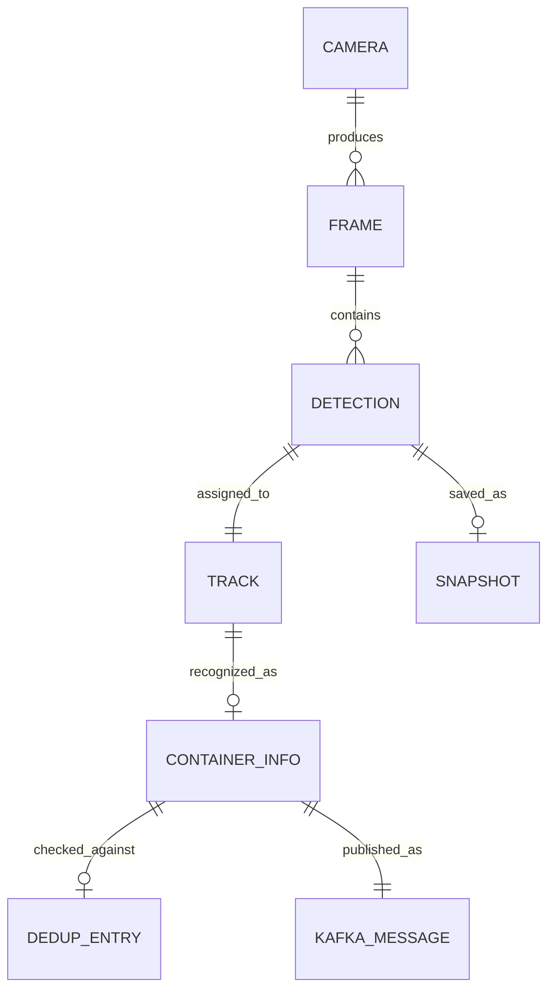

# Project Ontology

> Auto-maintained by Architect agent. Source of truth for domain knowledge.
> Last updated: 2026-02-12

<!-- TOKENS: ~800 -->

## 1. Project Overview

- **Goal:** Real-time detection and OCR recognition of ISO shipping container
  numbers from RTSP camera streams at port/logistics checkpoints, with
  deduplication and event publishing via Kafka.
- **Domain:** Computer Vision / Logistics / Port Automation
- **Constraints:**
  - Must run on NVIDIA GPU (DeepStream 8 + TensorRT 10)
  - Single-stream latency ≤ frame interval (30 FPS target)
  - 24-hour deduplication window (same container not reported twice)
  - Works with low-quality RTSP streams (night, rain, motion blur)
- **Tech Stack:** Python 3.12, DeepStream 8, GStreamer, YOLO (ONNX),
  PaddleOCR, Kafka, Redis, Prometheus, Docker

## 2. Glossary

| Term | Definition | Synonyms |
|------|-----------|----------|
| ISO Number | Unique 11-char container code per ISO 6346 (e.g. MSCU1234567) | Container ID, BIC code |
| Track | NvDCF-assigned object identity persisting across frames | Object track |
| Probe | GStreamer pad callback that intercepts frame buffers | Pad probe |
| Dedup | Deduplication — skipping already-reported containers | Deduplication |
| ADR | Architecture Decision Record — documented design choice | — |
| Increment | Vertical slice of functionality delivered as one unit | INC |
| Bounded Context | Self-contained domain area with clear boundaries | Module boundary |
| Ontology | Structured vocabulary and relations of the domain | Domain model |

## 3. Domain Model

### 3.1 Entities

| Entity | Description | Key Attributes |
|--------|------------|----------------|
| Camera | RTSP video source | uri, codec, resolution, fps |
| Frame | Single video frame extracted by DeepStream | frame_num, timestamp, surface (GPU) |
| Detection | YOLO bounding box on a frame | bbox (x,y,w,h), confidence, class_id |
| Track | Persistent identity across frames (NvDCF) | track_id, age, state |
| ContainerInfo | OCR result for a single container | iso_number, confidence, weight_gross, weight_tare, weight_net, weight_payload, volume_cbm |
| DedupEntry | Record of a previously seen container | iso_number, first_seen_ts, metadata |
| KafkaMessage | Published detection event | topic, key, payload (JSON), timestamp |
| Snapshot | JPEG image crop of detected container | file_path, frame_num, track_id |

### 3.2 Relations

### 3.3 Invariants

- **INV-01:** Each Track has at most one active ContainerInfo (best OCR result).
- **INV-02:** A container ISO number is published to Kafka at most once per 24h window.
- **INV-03:** OCR is attempted only on tracks older than `min_stable_frames` (5).
- **INV-04:** OCR retry count per track is capped at `max_ocr_attempts` (200).
- **INV-05:** Fuzzy dedup generates ≤50 OCR-confusion variants per lookup.

### 3.4 Events

| Event | Trigger | Affected Entities |
|-------|---------|-------------------|
| FrameArrived | GStreamer buffer on probe pad | Frame, Detection |
| ObjectDetected | YOLO confidence > threshold | Detection, Track |
| TrackCreated | New object_id from NvDCF | Track |
| OCRAttempted | Frame interval elapsed for track | Track, ContainerInfo |
| OCRSucceeded | ISO number recognized with confidence ≥ threshold | ContainerInfo, DedupEntry, KafkaMessage |
| TrackLost | Object exits frame / tracker drops | Track (→ send best partial result) |
| DuplicateFound | ISO number matches existing DedupEntry | DedupEntry (skip publish) |

## 4. Non-Functional Requirements

| NFR | Target | Priority |
|-----|--------|----------|
| Throughput | ≥25 FPS per stream | High |
| OCR Latency | <200ms per crop | High |
| Detection Latency | <50ms per frame (GPU) | High |
| Dedup Lookup | <5ms (Redis O(1)) | Medium |
| Memory (GPU) | <4 GB VRAM | Medium |
| Uptime | 24/7 with Docker restart policy | High |
| Observability | All key metrics in Prometheus | Medium |

## 5. Open Questions

- [ ] Multi-stream support: how many concurrent RTSP streams?
- [ ] Model retraining pipeline: how to update YOLO model in production?
- [ ] Edge deployment: can it run on Jetson Orin or only dGPU?
- [ ] Integration: what downstream systems consume Kafka events?
